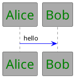

# PlantUML CSS `<style>` — Referenz

Quelle: [plantuml.com/de/style](https://plantuml.com/de/style) (Stand: offizielle Spezifikation). Bei Widersprüchen oder neuen Features die Live-Seite per `WebFetch` prüfen.

## Grundsyntax



- **Global:** `element`, `root`, top-level `arrow`
- **Diagrammspezifisch:** `sequenceDiagram`, `classDiagram`, `objectDiagram`, `mindmap`, `wbsDiagram`, `jsonDiagram`, `timingDiagram`, `ganttDiagram`, …
- **Stereotyp / Rolle:** `.classname` + `<<classname>>` am Element
- **Spezial:** `visibilityIcon { protected { ... } }`, WBS `:depth(n)`

## Properties (offiziell)

### Typografie

| Property  | Beschreibung         |
| --------- | -------------------- |
| FontName  | Schriftfamilie       |
| FontColor | Textfarbe            |
| FontSize  | Schriftgröße         |
| FontStyle | bold, italic, normal |

### Farbe & Hintergrund

| Property        | Beschreibung |
| --------------- | ------------ |
| BackGroundColor | Hintergrund  |
| HyperLinkColor  | Linkfarbe    |

### Rahmen & Linien

| Property       | Beschreibung                                                 |
| -------------- | ------------------------------------------------------------ |
| RoundCorner    | Eckenradius                                                  |
| DiagonalCorner | Diagonale Ecke                                               |
| LineColor      | Linien-/Rahmenfarbe                                          |
| LineThickness  | Linienstärke                                                 |
| LineStyle      | solid, dashed, dotted; Muster z. B. `10-5`, `4-4`, `8.0-3.0` |

### Abstand & Größe

| Property     | Beschreibung                                           |
| ------------ | ------------------------------------------------------ |
| Padding      | Innenabstand (ein Wert oder zwei: vertikal horizontal) |
| Margin       | Außenabstand                                           |
| MaximumWidth | Max. Breite (z. B. Mindmap)                            |

### Effekte & Ausrichtung

| Property                    | Beschreibung                  |
| --------------------------- | ----------------------------- |
| Shadowing                   | Schatten (numerisch, 0 = aus) |
| HyperlinkUnderlineStyle     | Link-Unterstreichung          |
| HyperlinkUnderlineThickness | Dicke Unterstreichung         |
| HorizontalAlignment         | left, center, right           |

## Häufige Selektoren nach Diagrammtyp

| Diagramm             | Block / Selektoren                                                                                      |
| -------------------- | ------------------------------------------------------------------------------------------------------- |
| Sequence             | `sequenceDiagram` → `participant`, `arrow`, `group`, `box`, `divider`, `lifeLine` / `lifeline`, `title` |
| Class                | `classDiagram` → `class`, `arrow`, `.stereotype`                                                        |
| Object               | `objectDiagram` → `object`                                                                              |
| Mindmap              | `node`, `rootNode`, `leafNode`, `arrow`                                                                 |
| WBS                  | `wbsDiagram`, `:depth(n)`, `.styleClass`                                                                |
| JSON/YAML            | `jsonDiagram` → `node`, `arrow`                                                                         |
| Gantt                | `ganttDiagram` → `task`, verschachtelt `unstarted`, `undone`                                            |
| Timing               | `timingDiagram` → `timeline`, `.class`                                                                  |
| Component / Activity | eigene Blöcke analog zur Spezifikation auf plantuml.com                                                 |

## Muster aus der Spezifikation

**Sequence — Stereotyp-Klassen:**

```plantuml
sequenceDiagram {
  .primary { FontColor darkred BackGroundColor #ffe6e6 }
}
participant "Alice" as A <<primary>>
```

**Pfeile — Stereotyp am Pfeil:**

```plantuml
arrow {
  LineColor green
  .critical { LineColor red }
}
A --> B <<critical>> : msg
```

**Class — visibilityIcon:**

```plantuml
visibilityIcon {
  protected {
    LineColor DarkGoldenRod
    BackGroundColor DarkGoldenRod
  }
}
```

**Gantt — Task-Status:**

```plantuml
ganttDiagram {
  task {
    BackGroundColor GreenYellow
    unstarted { BackGroundColor Fuchsia }
    undone { BackGroundColor red }
  }
}
```

## skinparam vs. `<style>`

| Aspekt      | skinparam                               | `<style>`                            |
| ----------- | --------------------------------------- | ------------------------------------ |
| Status      | deprecated (PlantUML)                   | empfohlen                            |
| Syntax      | `skinparam X { Key Value }`             | CSS-ähnliche Blöcke                  |
| Wartung     | diagrammtyp-spezifisch, verstreut       | zentral, verschachtelbar             |
| umltheme v3 | noch für Sequence-Legacy, DPI, Richtung | Haupt-Styling in `puml-theme-*.puml` |

Legacy parallel halten, bis Repo-Legacy-Support endet (`docs/style-guide/theme-development.md`).

## Verifikation

```bash
# Beispiel: lokales Render (PlantUML-JAR/PATH vorausgesetzt)
java -jar plantuml.jar -tpng examples/gen2/local_testing/v3-theme-light.puml
```

PlantUML-Version ≥ **1.2026.3** für volle CSS-Padding-Unterstützung.
