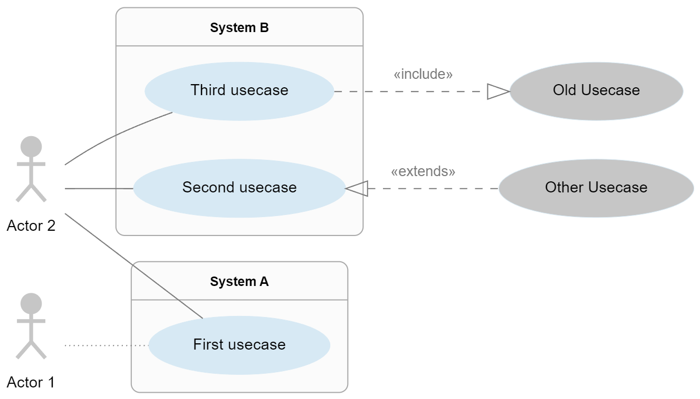
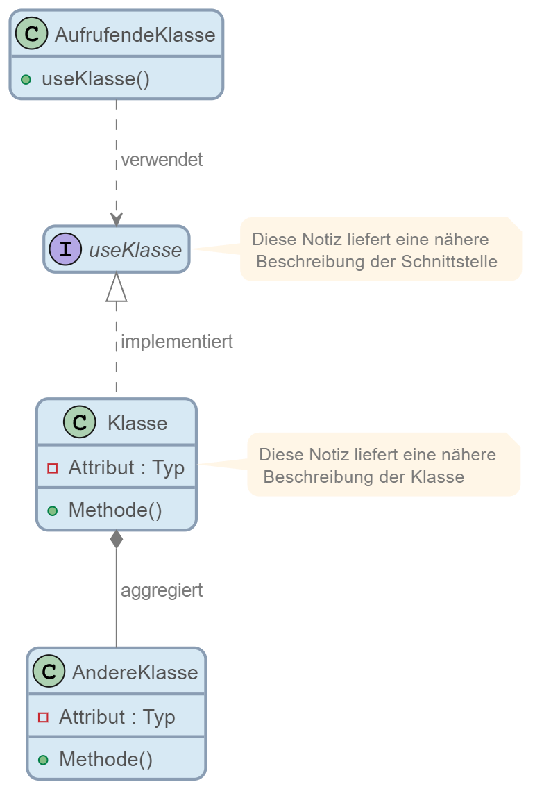
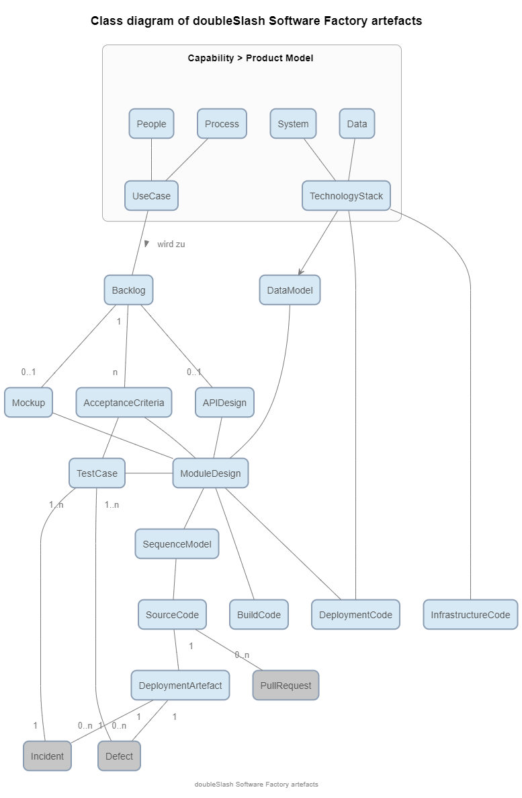

# umltheme
This repo contains doubleSlash CI styling information to include in plantUML drawings
Use stylings by including the theme file at the top of your code.

```
!include https://raw.githubusercontent.com/doubleSlashde/umltheme/main/puml-theme-doubleslash.puml
```

## Examples
see sub driectory examples
### Usecase model



### Class model 


## Other examples

### Data model of doubleSlash Software Factory



