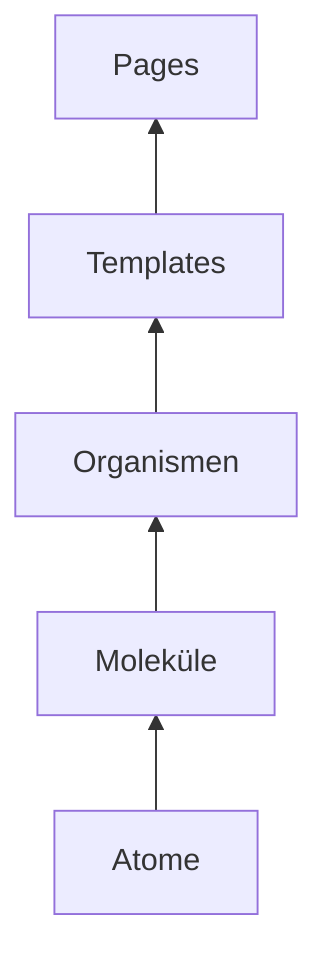

# PlantUML Style Guide

Normative Referenz für alle Styling-Entscheidungen im **doubleSlash PlantUML Theme**
([`doubleSlashde/umltheme`](https://github.com/doubleSlashde/umltheme)).

## Zweck & Geltungsbereich

| Zielgruppe            | Nutzen                                                                    |
| --------------------- | ------------------------------------------------------------------------- |
| **Diagramm-Autoren**  | Wissen, wie `.puml`-Dateien ohne Inline-Styling korrekt aussehen          |
| **Theme-Maintainer**  | Regeln für Token-Änderungen, PRs, Breaking Changes                        |
| **Architekten / POs** | [Executive Summary](executive-summary.md) — Überblick ohne PlantUML-Tiefe |

<!-- prettier-ignore-start -->
!!! tip "How to include vs. How to style"
    Include-URLs und Migration: [Getting started](../getting-started.md), [Theme usage](../theme-usage.md).
    Dieser Guide fokussiert auf **Styling-Regeln**.
<!-- prettier-ignore-end -->

## Design Principles

1. **Konsistenz vor Individualität** — Einheitliche CI-Farben & Paddings
2. **Lesbarkeit** — Mindestkontrast, klare Hierarchie
3. **Weniger ist mehr** — Keine überflüssigen Definitionen
4. **Theme-First** — Styling via Theme, nicht pro Diagramm neu erfinden

## Atomic Design

| Ebene          | Inhalt                                                    | Quelle im Repo                                |
| -------------- | --------------------------------------------------------- | --------------------------------------------- |
| **Atome**      | Farb-Tokens, Typo, Abstände, Modus-Schalter               | [`design-tokens.md`](design-tokens.md)        |
| **Moleküle**   | `!startsub`-Blöcke, Stereotypen, Padding-Gate, Prozeduren | [`global-defaults.md`](global-defaults.md)    |
| **Organismen** | Diagrammtyp-Regeln                                        | [`diagram-types/`](diagram-types/sequence.md) |
| **Templates**  | Include-Patterns                                          | [Templates](#templates-include-patterns)      |
| **Pages**      | Golden Samples                                            | [`examples-gallery.md`](examples-gallery.md)  |



## Klassifikation von Vorgaben

| Klassifikation       | Definition                                 | Beispiel                                         |
| -------------------- | ------------------------------------------ | ------------------------------------------------ |
| **Global**           | Gilt nach `!include doubleslash-gen2.puml` | `defaultFontName`, `ArrowColor`, `roundcorner`   |
| **Diagrammtyp**      | Nur für einen `@start…`-Typ                | `skinparam sequence { … }`, `ganttDiagram { … }` |
| **Stereotyp/Domain** | Querschnitt                                | `<<external>>`, `<<container>>`                  |
| **Bundle-Override**  | Nur bei Spezial-Include                    | System: blaue Rectangle-Borders                  |
| **Autor-Lokal**      | Im Diagramm, eingeschränkt                 | Einmaliges Layout-`!pragma` mit Begründung       |

## Entscheidungsbaum

```txt
Will ich X ändern?
├─ Token?           → design-tokens.md / Maintainer-PR
├─ Molekül?         → !startsub oder Stereotyp in Gen2
├─ Diagramm-Sub?    → diagram-types/<typ>.md
├─ Neues Bundle?    → puml-theme-gen2-*.puml
└─ Einmal-Ausnahme? → authoring-rules.md (Autor-Lokal)
```

## Templates (Include-Patterns)

### Universal (empfohlen)

```txt
!include https://raw.githubusercontent.com/doubleSlashde/umltheme/main/doubleslash/doubleslash-gen2.puml
```

### Light / Dark

```txt
!include .../doubleslash/light.puml
!include .../doubleslash/dark.puml
```

### Spezial-Bundles

```txt
!include .../doubleslash/puml-theme-gen2-system.puml
!include .../doubleslash/puml-theme-gen2-gantt.puml
```

Lokale relative Includes: [`examples/gen2/local_testing/`](https://github.com/doubleSlashde/umltheme/tree/main/examples/gen2/local_testing/)
